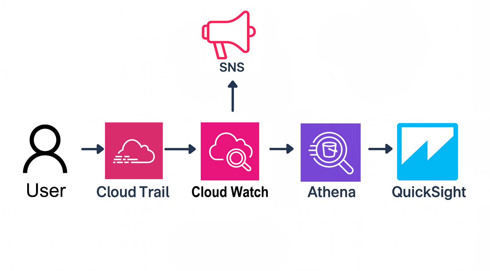

# AWS CSS - Domain 2 - Centralized Security Monitoring with CloudTrail + CloudWatch + Athena + QuickSight.

Built a centralized logging and monitoring architecture in AWS using **CloudTrail, CloudWatch, Athena and QuickSight** to detect suspicious API activity such as root account usage, API calls without MFA and attempts to disable logging.

**Why it matters:** Security analytics on CloudTrail logs allow proactive detection of risky behavior across an AWS Organization. By combining logging, alerts and query-based hunting, teams gain real-time visibility and the ability to investigate at scale.

---

## Table of Contents

- [Overview](#overview)  
- [Objectives](#objectives)  
- [Diagram](#diagram)  
- [Steps Performed](#steps-performed)  
  - [1. CloudTrail Setup & Log Delivery]  
  - [2. CloudWatch Alarms for Critical Events]  
  - [3. Athena Threat-Hunting Queries]  
  - [4. Visualization with QuickSight]  
- [Screenshots](#screenshots)  
- [Lessons Learned](#lessons-learned)  
- [References](#references)  
- [Contact](#contact)  

---

## Overview

CloudTrail is the foundation for AWS security monitoring, but raw logs in S3 are not actionable. This lab demonstrates how to:

- Centralize CloudTrail logs across accounts.  
- Detect high-risk API activity with CloudWatch alarms.  
- Hunt for suspicious events with Athena queries.  
- Build visual dashboards in QuickSight for analytics at scale.  

---

## Objectives

- Enable **organization-wide CloudTrail logging**.  
- Detect sensitive events like **ConsoleLogin**, **DeleteBucket** and **StopLogging**.  
- Query logs in **Athena** for insights into MFA usage and root account activity.  
- Visualize results with **QuickSight dashboards**.  
- Deliver alerts via **SNS** for immediate notification.  

---

## Diagram

Flow: CloudTrail Logs → S3 → CloudWatch Alarms (real-time detection) → Athena Queries (threat hunting) → QuickSight Dashboard (visualization & reporting) → SNS Notifications  

---

## Steps Performed

- **1. CloudTrail Setup & Log Delivery**  
   - Created org-wide CloudTrail trail `OrgSecurityTrail`.  
   - Configured delivery to S3 bucket `org-security-trail-logs-ssc`.  
   - Validated logs stored in S3 *(Screenshots: `S3-BucketLogs.png` & `CloudTrail-LogFile.png`)*  
   - Integrated CloudTrail with CloudWatch Logs *(Screenshot: `CloudTrail-To-CloudWatch.png`)*  

- **2. CloudWatch Alarms for Critical Events**  
   - Created metric filter for `ConsoleLogin`.  
   - Configured CloudWatch Alarm on `ConsoleLoginCount` metric.  
   - Delivered real-time notifications via SNS.  
   - Validated alarm triggered on login *(Screenshots: `MetricFilter-ConsoleLogin.png`, `CloudWatch-Metric-ConsoleLogin.png`, `CloudWatch-Alarm-ConsoleLogin.png`, `CloudWatch-Alarm-Triggered.png`, `SNS-SubscriptionEmail.png` & `SNS-EmailAlert.png`)*  

- **3. Athena Threat-Hunting Queries**  
   - Created Athena database `cloudtraillabdb`.  
   - Defined external table `cloudtrail_events` pointing to CloudTrail logs.  
   - Ran baseline queries to sample logs *(Screenshot: `Athena-QuerySample.png`)*  
   - Queried for **API calls without MFA** and **Root account usage** *(Screenshots: `Athena-NonMFA.png` & `Athena-RootUsage.png`)*  
   - Built advanced query for **Top 5 API calls by frequency** *(Screenshot: `Athena-Top5APICalls.png`)*  
   - Saved queries for reuse *(Screenshot: `Athena-SavedQueries.png`)*  

- **4. Visualization with QuickSight**  
   - Connected Athena as a QuickSight data source *(Screenshots: `QuickSight-ConnectAthena.png`, `QuickSight-SelectTable.png` & `QuickSight-Dataset-DirectQuery.png`)*  
   - Built analysis using flattened dataset `cloudtrail_events_flat`.  
   - Created table and bar chart visuals for event analytics.  
   - Published dashboard `Security Analytics Dashboard` *(Screenshot: `QuickSight-EventCounts.png`)*  

---

## Screenshots

*All screenshots are included in the `screenshots/` folder.*

| Step | Filename                                | Description                                         |
| ---- | --------------------------------------- | ----------------------------------------------------|
| 1    | S3-BucketLogs.png                       | S3 bucket containing CloudTrail logs                |
| 1    | CloudTrail-LogFile.png                  | Raw CloudTrail JSON event in S3                     |
| 1    | CloudTrail-To-CloudWatch.png            | Trail integrated with CloudWatch Logs               |
| 2    | MetricFilter-ConsoleLogin.png           | Metric filter for detecting ConsoleLogin events     |
| 2    | CloudWatch-Metric-ConsoleLogin.png      | ConsoleLoginCount metric visible in CloudWatch      |
| 2    | CloudWatch-Alarm-ConsoleLogin.png       | CloudWatch Alarm created on ConsoleLoginCount       |
| 2    | CloudWatch-Alarm-Triggered.png          | Alarm triggered after login event                   |
| 2    | SNS-SubscriptionEmail.png               | SNS email subscription confirmation                 |
| 2    | SNS-EmailAlert.png                      | Real-time SNS alert delivered via email             |
| 3    | Athena-CreateDatabase.png               | Athena database created for CloudTrail              |
| 3    | Athena-CreateTable.png                  | External table defined on CloudTrail logs           |
| 3    | Athena-QuerySample.png                  | Sample query results from CloudTrail logs           |
| 3    | Athena-NonMFA.png                       | Query results: API calls without MFA                |
| 3    | Athena-RootUsage.png                    | Query results: Root account usage                   |
| 3    | Athena-Top5APICalls.png                 | Query results: Top 5 API calls by frequency         |
| 3    | Athena-SavedQueries.png                 | Saved queries in Athena                             |
| 4    | QuickSight-ConnectAthena.png            | QuickSight data source connected to Athena          |
| 4    | QuickSight-SelectTable.png              | QuickSight dataset table selection                  |
| 4    | QuickSight-Dataset-DirectQuery.png      | Dataset creation with direct query option           |
| 4    | QuickSight-EventCounts.png              | QuickSight bar chart showing event counts           |

---

## Lessons Learned

- **CloudTrail is central**: It provides the raw data needed for all AWS security monitoring.  
- **CloudWatch detects in real time**: Metric filters and alarms ensure immediate visibility into sensitive events.  
- **Athena scales threat hunting**: SQL queries let you investigate activity patterns without standing up infrastructure.  
- **QuickSight makes it visual**: Dashboards make trends obvious for managers and security teams.  
- **Permissions matter**: Missing QuickSight S3 permissions caused initial errors — always check IAM + bucket access.  
- **Real-world takeaway**: Combining **logging, monitoring, analytics and visualization** provides a complete security monitoring pipeline.  

---

## References

- [AWS CloudTrail Documentation](https://docs.aws.amazon.com/awscloudtrail/latest/userguide/cloudtrail-user-guide.html)  
- [Amazon CloudWatch](https://docs.aws.amazon.com/AmazonCloudWatch/latest/monitoring/WhatIsCloudWatch.html)  
- [Amazon Athena](https://docs.aws.amazon.com/athena/latest/ug/what-is.html)  
- [Amazon QuickSight](https://docs.aws.amazon.com/quicksight/latest/user/welcome.html)  
- [Amazon SNS](https://docs.aws.amazon.com/sns/latest/dg/welcome.html)  

---

## Contact

Sebastian Silva C. – September 2025 – Berlin, Germany.  
- [LinkedIn](https://www.linkedin.com/in/sebastiansilc/)  
- [GitHub](https://github.com/SebaSilC)  
- [sebastian@playbookvisualarts.com](mailto:sebastian@playbookvisualarts.com)  
